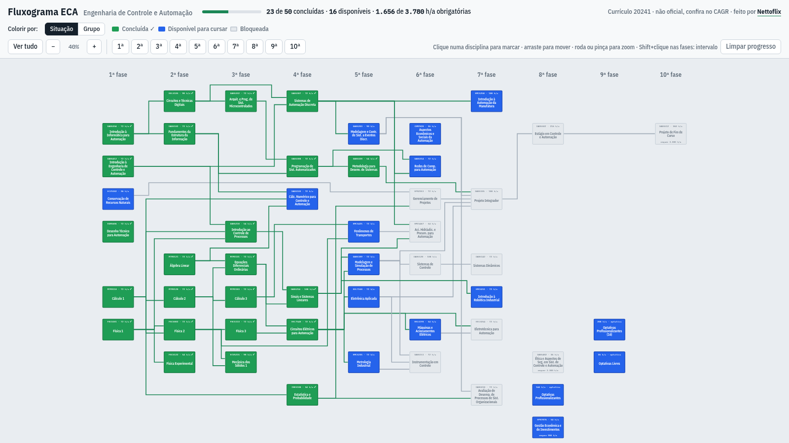
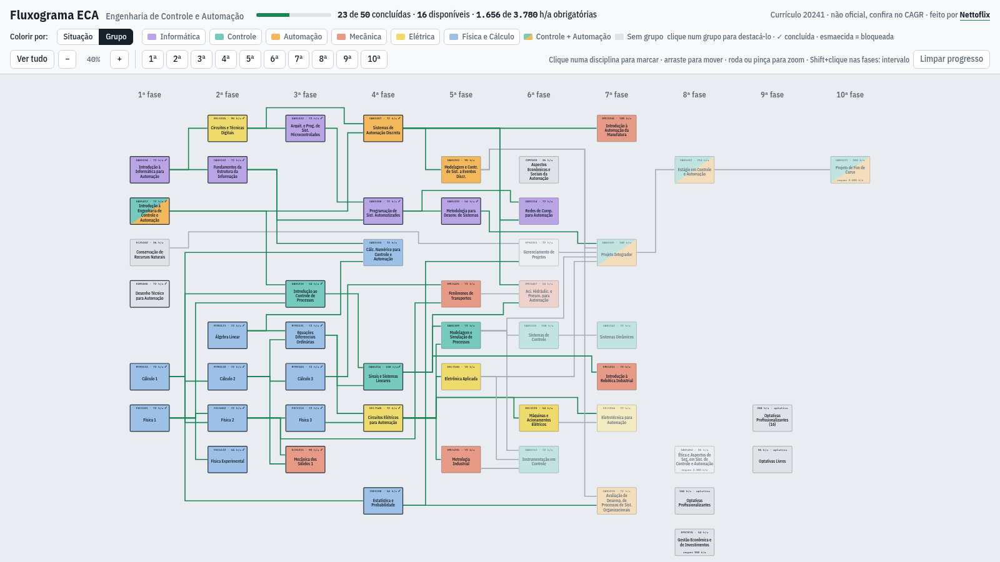

# Fluxograma ECA

Fluxograma interativo de currículos da UFSC. O padrão é o de
**Engenharia de Controle e Automação** (currículo 20241), e a lista
*Currículo* no topo da página traz outros cursos e currículos. Você marca as disciplinas que já cursou, e ele mostra o
que está liberado para cursar, o que ainda está bloqueado e por quê,
incluindo as exigências de carga horária.

**Use no navegador (PC ou celular):**
<https://nettoflix.github.io/DiagramasECA/web/>



> **Aviso:** projeto pessoal e **não oficial**. Os pré-requisitos e as
> cargas horárias foram transcritos dos currículos publicados no CAGR, mas
> confira sempre lá antes da matrícula.

## O que dá para fazer

- **Marcar o que você já cursou.** Um toque ou clique numa disciplina marca
  ou desmarca. Desmarcar uma disciplina também desmarca, em cascata, as que
  dependiam dela.
- **Ver o que está liberado.** No modo *Situação*:
  - **verde ✓**: concluída;
  - **azul**: disponível para cursar agora;
  - **cinza**: bloqueada.
- **Saber o que falta.** Tocar numa disciplina bloqueada mostra quais
  pré-requisitos faltam e quantas horas-aula ainda são necessárias.
- **Acompanhar a carga horária.** O cabeçalho soma as horas-aula
  obrigatórias concluídas. Três disciplinas exigem um mínimo de horas
  obrigatórias concluídas (o "Pré CH" do currículo):

  | Disciplina | Exige |
  |---|---|
  | Ética e Aspectos de Segurança (DAS5402) | 2.300 h/a |
  | Gestão Econômica e de Investimentos (EPS7076) | 900 h/a |
  | Projeto de Fim de Curso (DAS5512) | 3.000 h/a |

- **Ver as áreas do curso.** No modo *Grupo*, as disciplinas são coloridas
  por área: Informática, Controle, Automação, Mecânica, Elétrica e Física e
  Cálculo. Disciplinas de duas áreas aparecem com a caixa dividida na
  diagonal. Clicar num grupo na legenda destaca só as disciplinas dele. Os
  grupos (nomes e cores) são os declarados na seção `[Grupos]` do arquivo de
  disciplinas; um currículo sem essa seção mostra só o modo *Situação*.
- **Seguir as dependências.** No PC, passar o mouse sobre uma disciplina
  destaca de onde ela vem e o que ela libera.
- **Navegar com zoom.**
  - `Ver tudo`, `−` e `+`;
  - os botões `1ª`…`10ª` focam numa fase, e Shift+clique noutra fase foca
    o intervalo entre elas;
  - pinça ou roda do mouse para zoom, e arrastar para mover.

O progresso fica salvo **só no seu navegador**: sem login e sem servidor.

- **Escolher o currículo.** A lista *Currículo* traz os currículos de
  `files/curriculos/lista.txt` (para acrescentar um, coloque o `.txt` na
  pasta e uma linha na lista). O progresso é separado por currículo.
- **Usar um arquivo próprio.** *Carregar currículo…* abre um arquivo no
  formato de `files/disciplinas.txt` e monta o fluxograma, com as linhas, no
  próprio navegador. Ele fica na lista como "Arquivo carregado".
- **Editar o currículo sem mexer no texto.** *Editar currículo* abre um
  editor em formulário (fases, disciplinas, horas, pré-requisitos escolhidos
  numa lista, grupos), que aponta os erros na hora e baixa o `.txt` pronto.



## Como o projeto está organizado

O repositório tem duas versões do mesmo fluxograma, que usam os mesmos
dados:

| Pasta / arquivo | O que é |
|---|---|
| `web/` | **Versão web**, a que os colegas usam. `index.html` com o currículo padrão embutido, a lista *Currículo* (lida de `files/curriculos/lista.txt`) e o botão *Carregar currículo…*, que monta o fluxograma a partir de qualquer `disciplinas.txt` (com `curriculo.js`). Veja [`web/README.md`](web/README.md). |
| `files/curriculos/` | Os currículos da lista da versão web (um `.txt` cada) e `lista.txt`, com os que aparecem e o nome exibido. |
| `*.cpp`, `*.h`, `Diagramas2.pro` | **Aplicativo desktop** em Qt 5 (C++), a versão original. |
| `files/disciplinas.txt` | **Fonte única dos dados do curso**, organizada por fase: disciplinas, posição na grade, pré-requisitos, horas-aula e grupos. O formato está descrito no cabeçalho do próprio arquivo. O app lê o arquivo ao abrir, e `disciplinas.py` o lê para os scripts Python. |
| `web/roteador.js` | **Roteador das linhas** entre as disciplinas (roteamento ortogonal otimizado por simulated annealing). É o mesmo arquivo na versão web e no app Qt, que o executa com o `QJSEngine`. |
| `files/linhas.json` | Cache das linhas calculadas, junto com a entrada que as gerou (posições e pré-requisitos). O app recalcula sozinho quando algo muda. |
| `files/saved.txt` | Progresso salvo pelo app desktop (as linhas gravadas nele não são mais lidas). |
| `gerador_linhas/` | Versão original do gerador de linhas, em Python, com a explicação detalhada do método. Veja [`gerador_linhas/README.md`](gerador_linhas/README.md). |
| `docs/` | Imagens deste README. |

### Fluxo de dados

```
files/disciplinas.txt ──► app Qt: monta a grade ──► web/roteador.js ──► files/linhas.json
         │                                                                  │
         └────────────────────►  web/gerar_dados.py  ◄──────────────────────┘
                                         │
                                         ▼
                                  web/index.html
```

## Atualizar o currículo

Quando mudar algum pré-requisito, disciplina, carga horária ou grupo:

1. Edite `files/disciplinas.txt` (não precisa recompilar: o app lê o
   arquivo da pasta `files/` ao lado do executável). Quem não quiser
   mexer no texto pode usar *Editar currículo* na versão web e substituir
   o arquivo pelo `.txt` baixado.
2. Abra o app. Se as posições ou os pré-requisitos mudaram, ele recalcula
   as linhas em segundo plano (cerca de 10 s; aparece "Calculando as
   linhas…" na barra) e atualiza `files/linhas.json`. Nas próximas
   aberturas as linhas vêm do cache.
3. Regere os dados da versão web:

   ```bash
   python3 web/gerar_dados.py
   ```

4. Faça commit (inclusive de `files/linhas.json`) e push. O GitHub Pages publica o novo `web/index.html`.

Se só mudou carga horária, nome ou grupo, as linhas continuam valendo e
basta o passo 3.

Na versão web, o ECA 2024 da lista vem de
`files/curriculos/engenharia_de_controle_e_automacao_20241.txt`: mantenha-o
igual a `files/disciplinas.txt` (as disciplinas; os comentários podem ser
diferentes). Se os dois divergirem, a página continua certa, mas mostra o
arquivo da lista e calcula as linhas no navegador de cada estudante na
primeira visita, em vez de usar as embutidas.

Os outros currículos da lista não precisam de nada disso: basta trocar o
`.txt` em `files/curriculos/` e fazer push.

## Aplicativo desktop (Qt)

Requer Qt 5 (testado com Qt 5.9.6, módulos `qml` e `concurrent`) e um
compilador C++.

```bash
qmake Diagramas2.pro
make
./Diagramas2
```

O app lê `files/disciplinas.txt` e `files/linhas.json` e grava
`files/saved.txt`, todos na pasta `files/` ao lado do executável.

Controles:
- **Tecla `1`:** salva o progresso.
- **Tecla `2`:** recarrega.
- **Zoom:** barra de ferramentas, Ctrl+roda do mouse, Ctrl+0, Ctrl+= e Ctrl+−.
- **Mover:** arrastar com o botão do meio.

Há também um modo de edição manual de linhas, usado antes do gerador
automático:
- **Shift** (apertar e soltar) liga e desliga o modo.
- Clique na disciplina de origem e depois nos pontos da linha.
- **H** ou **V** seguradas travam o segmento na horizontal ou na vertical.
- **`+`** e **`-`** trocam de linha.
- **C** apaga todas as linhas.

## Créditos

Feito por **Nettoflix**. Encontrou um pré-requisito errado ou tem uma ideia?
Abra uma *issue* aqui no GitHub ou me chame.
