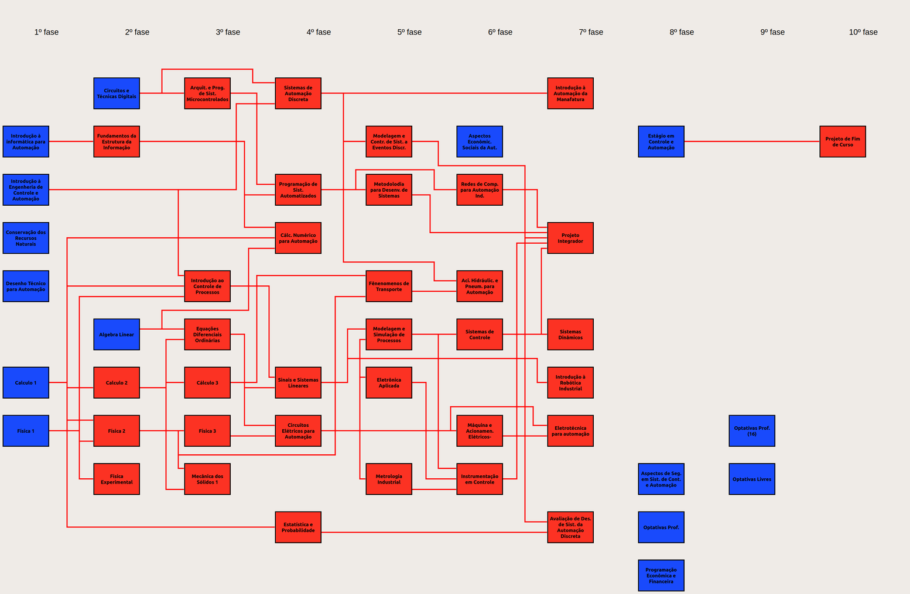
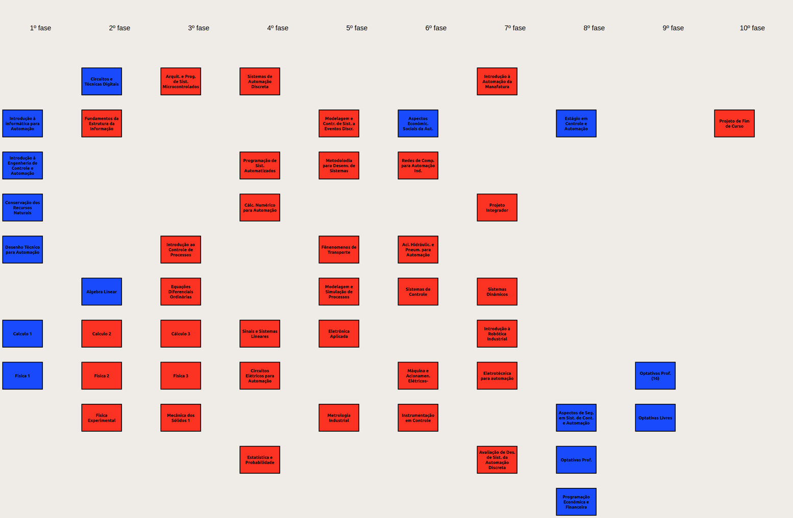
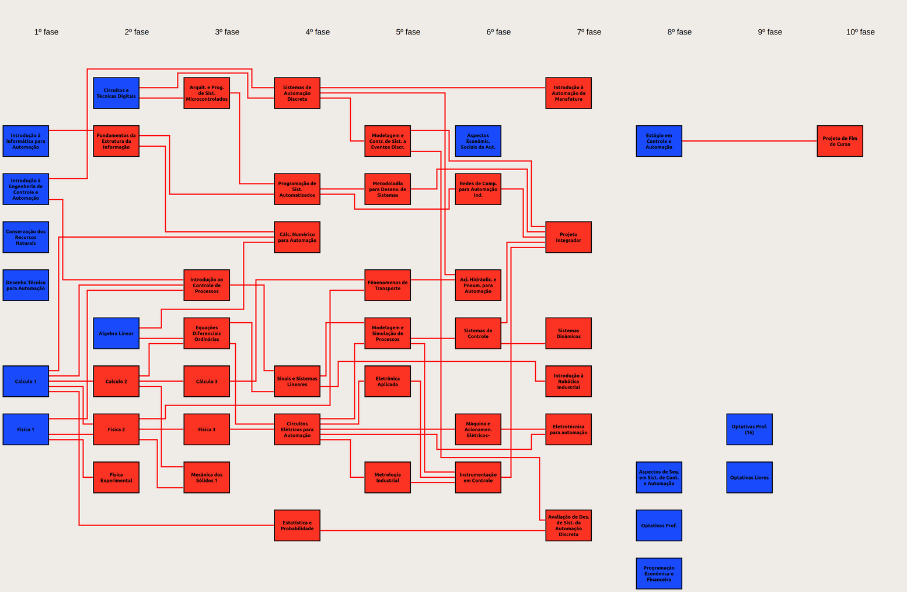
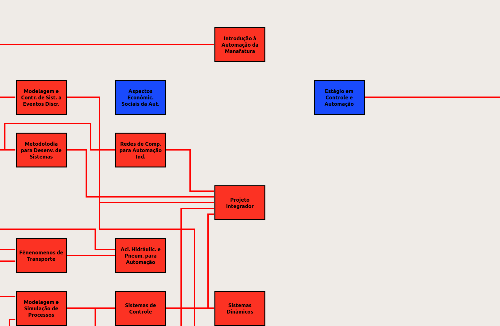

# Gerador das linhas de pré-requisito (`files/saved.txt`)

Esta pasta contém tudo o que foi usado para gerar automaticamente o arquivo
`files/saved.txt` — o JSON com as coordenadas das linhas que ligam cada
disciplina (diagrama) aos seus pré-requisitos — e explica o procedimento em
detalhe.



---

## Sumário

1. [Conteúdo da pasta](#1-conteúdo-da-pasta)
2. [Como usar (receita rápida)](#2-como-usar-receita-rápida)
3. [O problema](#3-o-problema)
4. [Etapa 1 — Entender como o app desenha as linhas](#4-etapa-1--entender-como-o-app-desenha-as-linhas)
5. [Etapa 2 — Medir a geometria real dos diagramas](#5-etapa-2--medir-a-geometria-real-dos-diagramas)
6. [Etapa 3 — Discretizar o espaço em trilhas](#6-etapa-3--discretizar-o-espaço-em-trilhas)
7. [Etapa 4 — Moldes de rota](#7-etapa-4--moldes-de-rota)
8. [Etapa 5 — Modelo de "tronco" (uma árvore por pré-requisito)](#8-etapa-5--modelo-de-tronco-uma-árvore-por-pré-requisito)
9. [Etapa 6 — Função de custo](#9-etapa-6--função-de-custo)
10. [Etapa 7 — Otimização: simulated annealing + busca local](#10-etapa-7--otimização-simulated-annealing--busca-local)
11. [Etapa 8 — Validação e inspeção visual](#11-etapa-8--validação-e-inspeção-visual)
12. [Histórico das iterações](#12-histórico-das-iterações)
13. [A técnica em termos gerais](#13-a-técnica-em-termos-gerais)
14. [Limitações](#14-limitações)
15. [Sugestões de estudo](#15-sugestões-de-estudo)

---

## 1. Conteúdo da pasta

| Arquivo | Função |
|---|---|
| `probe/main.cpp` | `main()` alternativo do app: abre a janela, espera 2,5 s, imprime a geometria de cada `Diagram` e salva um PNG da renderização (`container->grab()`, em escala 1:1, independente do zoom). Encontra o container através do `QGraphicsProxyWidget` da `ZoomView`. |
| `render.sh` | Compila uma cópia do projeto com o `probe/main.cpp` (em `build/`, sem tocar no projeto), carrega um JSON de linhas e gera PNG + geometria medida. |
| `route.py` | Leitura de `widget.cpp` (nomes e pré-requisitos), leitura da geometria medida, definição das trilhas e dos moldes de rota. Também contém a **1ª versão** do roteador (uma linha independente por aresta). |
| `route2.py` | Roteador **final** (modelo de tronco + simulated annealing). É ele que gera o `saved.txt`. |
| `validate.py` | Verificador independente do JSON gerado. |
| `dados/geometria_medida.txt` | Saída do probe na tela real (1920×1080) — é a entrada do roteador. |
| `dados/saved_gerado.json` | O arquivo gerado (idêntico a `../files/saved.txt`). |
| `imagens/` | Renderizações feitas pelo próprio Qt em cada fase do trabalho. |

Dependências: Qt 5 (o `qmake` do projeto), Python 3, `numpy` e `Pillow`.

---

## 2. Como usar (receita rápida)

Execute dentro desta pasta (`gerador_linhas/`):

```bash
# 1) (só se o layout mudou) medir a geometria real dos diagramas.
#    Abre a janela do app por ~2 s na tela atual.
#    Qualquer JSON serve aqui; a geometria não depende das linhas.
QMAKE=~/Qt5.9.6/5.9.6/gcc_64/bin/qmake ./render.sh dados/saved_gerado.json medicao
cp medicao_geometria.txt dados/geometria_medida.txt

# 2) gerar as linhas (iterações, semente, arquivo de saída).
#    Rodar várias sementes e ficar com a de menor "cost".
for s in 31 32 33 34 35 36 37; do
  python3 route2.py 200000 $s saida_$s.json > saida_$s.log &
done; wait
grep -h "^seed" saida_*.log | sort -k4 -g        # menor custo primeiro

# 3) validar e ver o resultado
python3 validate.py saida_35.json
./render.sh saida_35.json preview                # gera preview.png / preview_small.png

# 4) instalar
cp saida_35.json ../files/saved.txt
```

Com 7 sementes em paralelo, o passo 2 leva cerca de 4 minutos.

---

## 3. O problema

- Existem **49 diagramas** (disciplinas) dispostos num `QGridLayout`: cada
  coluna é uma fase e cada linha da grade é uma posição vertical.
- `Widget::initPrerequisites()` define **56 relações** "A é pré-requisito
  de B".
- A regra pedida é que **a linha de cada pré-requisito sai dele mesmo e
  chega na disciplina que depende dele**. Como todo pré-requisito está numa
  fase anterior, as linhas vão sempre da esquerda para a direita.
- O resultado deve ser **coerente e agradável visualmente**: sem atravessar
  caixas, sem linhas sobrepostas ambíguas e com poucos cruzamentos e curvas.

Não existe resposta única. É um problema de otimização com vários
critérios estéticos concorrentes.

---

## 4. Etapa 1 — Entender como o app desenha as linhas

Lendo o código do projeto:

- **Formato do arquivo** (`Widget::saveLines` / `Widget::loadLines`):

  ```json
  { "Diagramas": {
      "<nome do diagrama>": {
        "isActive": false,
        "lines": [ [ {"x": 170, "y": 484}, {"x": 316, "y": 484} ], ... ]
      }, ... } }
  ```

  O nome é exatamente o texto passado ao construtor `Diagram(...)`, com
  acentos. Cada linha é uma polilinha, ou seja, uma lista de pontos
  ligados por segmentos retos.
- **As linhas pertencem ao diagrama de origem.** `diagram->lines[i]`
  recebe a i-ésima polilinha do JSON. Como o construtor de `Diagram` cria
  **8** `ConnectingLine`, cada diagrama pode ter **no máximo 8 linhas**;
  mais que isso quebraria o `loadLines`. Aqui o máximo é 5.
- **Sistema de coordenadas.** `ConnectingLine` é filha do `container`, com
  geometria `(0,0,MAX,MAX)`, e desenha os pontos diretamente com
  `QPainter::drawLine`. Logo, as coordenadas são **relativas ao
  `container`** (o widget dentro da `QScrollArea`).
- **Cor.** A cor da linha depende do estado do diagrama de **origem**
  (vermelho = não cursada; azul = cursada). Isso permite que linhas da
  mesma origem se sobreponham sem ambiguidade, o que é importante na
  [Etapa 5](#8-etapa-5--modelo-de-tronco-uma-árvore-por-pré-requisito).
- **Convenção do ponto inicial.** Em `Widget::mousePressEvent`, o primeiro
  ponto de uma linha fica em `pos().x() + width() + 2`, ou seja, 2 px à
  direita da borda direita. Com a caneta de 4 px e ponta quadrada, a linha
  encosta exatamente na borda. Pelo mesmo raciocínio, a linha termina em
  `x_borda_esquerda − 3`.

---

## 5. Etapa 2 — Medir a geometria real dos diagramas

Em vez de *supor* as posições a partir do código do layout, compilei uma
cópia instrumentada do app (`probe/main.cpp`) e rodei na tela real. Ela
imprime:

```
GRID margins 9 9 9 9 hsp 10 vsp 6 rows 12 cols 10
ROW 1 y 215 h 159      COL 0 x 9   w 300
ROW 2 y 380 h 159      COL 1 x 319 w 300   ...
DIAG  Calculo 1   7  0  9  1205  159  159     (nome, linha, coluna, x, y, w, h)
```

A medição corrigiu duas suposições que estariam erradas:

1. **Os diagramas ficam alinhados à esquerda da célula**, e não
   centralizados. Sem `alignment` no `addWidget`, o `QWidgetItem` posiciona
   o widget no canto superior esquerdo. Portanto `x = 9 + 310·coluna` e
   `y = 215 + 165·(linha − 1)`.
2. **A caixa visível é menor que o widget.** O stylesheet
   `margin-top: 50px` (em `Diagram::paintDiagramColor`) faz o botão ser
   pintado só de `y+50` a `y+159`. Os 50 px de cima são **transparentes**,
   e é por essa faixa que as linhas horizontais podem passar entre as
   linhas da grade.



Outro ponto importante: na época da geração, com a janela maximizada em
1920×1080, a viewport (1812×978) era **menor** que o tamanho mínimo do
container (3108×2033). Então o `QGridLayout` não distribuía espaço extra e
as posições eram determinísticas. Hoje, com o zoom, o container sempre tem
o tamanho natural. Veja as [Limitações](#14-limitações).

O mesmo probe salva um PNG da renderização. Ele foi usado em todas as
etapas para **ver** o resultado exatamente como o Qt desenha.

---

## 6. Etapa 3 — Discretizar o espaço em trilhas

O espaço livre entre as caixas forma uma grade de "ruas":

- **Canais verticais** entre duas fases: 151 px de largura (da borda
  direita de uma coluna até a borda esquerda da próxima).
- **Corredores horizontais** entre duas linhas da grade: 56 px de altura.

Em vez de permitir qualquer coordenada, as linhas só podem usar **trilhas
fixas** (em inglês, *tracks* ou *lanes*):

| Onde | Nº de trilhas | Espaçamento | Posição |
|---|---|---|---|
| Portas (lateral de cada caixa) | 5 | 18 px | centro da caixa, ±18, ±36 |
| Canal vertical entre fases | 9 | 14 px | centro do canal ±14·k, k = −4…4 |
| Corredor horizontal entre linhas | 3 | 14 px | centro do corredor, ±14 |

Vantagens:

- as linhas ficam naturalmente **alinhadas e com espaçamento uniforme**, o
  que dá aspecto "limpo";
- o problema vira **combinatório**: escolher uma trilha dentre poucas, em
  vez de escolher coordenadas contínuas;
- como trilhas de tipos diferentes nunca ficam a menos de 14 px uma da
  outra, duas linhas só se colam se usarem **a mesma trilha**, o que é
  fácil de detectar.

---

## 7. Etapa 4 — Moldes de rota

Todas as linhas são **ortogonais** (só segmentos horizontais e verticais).
Para uma relação origem (fase `cs`, linha `rs`) → destino (fase `ct`,
linha `rt`), o roteador escolhe um de dois moldes:

```
T1(k):  Origem ──────┐                    se as alturas coincidem, vira reta:
                     │  canal k           Origem ──────────────── Destino
                     └────── Destino

T2(a,g,b):  Origem ──┐                ┌──── Destino
                     │ canal a        │ canal b
                     └── corredor g ──┘
```

- **T1(k)**: sai na horizontal, desce/sobe no canal `k` e entra na
  horizontal. É válido se as células atravessadas na horizontal estiverem
  **vazias**: na linha `rs` entre a origem e o canal `k`, e na linha `rt`
  entre o canal `k` e o destino.
- **T2(a, g, b)**: usado quando não há caminho direto. Sobe/desce no canal
  `a`, cruza fases pelo **corredor** `g` entre duas linhas da grade (que
  está sempre livre) e sobe/desce no canal `b` até o destino.

`route.py::templates()` enumera todos os moldes válidos de cada relação.
Por construção, **nenhuma rota válida atravessa uma caixa**.

Exemplos deste projeto:

- *Sistemas de Automação Discreta → Introdução à Automação da Manufatura*:
  as fases 5 e 6 estão vazias na linha 1, então é uma **reta** atravessando
  as células vazias.
- *Programação de Sist. Automatizados → Redes de Comp.*: "Metodologia" está
  no meio do caminho, então a rota é **T2**, contornando pelo corredor de
  cima.

---

## 8. Etapa 5 — Modelo de "tronco" (uma árvore por pré-requisito)

A primeira versão (`route.py`) tratava cada relação como uma linha
independente, com sua própria porta de saída. O resultado era correto, mas
emaranhado: cerca de 37 cruzamentos e muitas linhas paralelas coladas perto
das caixas com várias saídas (Cálculo 1 e Circuitos Elétricos têm 5 cada).



A versão final (`route2.py`) usa um **modelo de árvore por origem**:

- cada disciplina de origem tem **uma única porta de saída** e **uma
  trilha de tronco** no canal à sua direita;
- as rotas de todas as relações dessa origem partem da mesma porta e
  compartilham o tronco. Delas saem ramos para cada dependente;
- no cálculo de custo, os segmentos colineares da mesma origem são
  **unidos** (`merge()`), então sobreposição dentro da mesma árvore é
  permitida e não conta como conflito. Um cruzamento com o tronco conta
  **uma vez**, e não uma vez por ramo;
- as **entradas continuam separadas**: cada relação chega ao destino numa
  altura própria, porque linhas de origens diferentes podem ter cores
  diferentes.

Isso é justificável porque a cor é por origem: as linhas de uma mesma
árvore mudam de cor juntas. É o mesmo estilo que o `saved.txt` antigo,
desenhado à mão, já usava para Cálculo 1 (várias linhas partindo do mesmo
ponto). O resultado caiu para cerca de 28 cruzamentos.


### Variáveis de decisão

| Por origem | Por relação (aresta) |
|---|---|
| trilha da porta de saída (5 opções) | molde (T1(k) ou T2(a,g,b)) |
| trilha do tronco no 1º canal (9 opções) | trilha da porta de entrada no destino (5) |
| | trilhas dos trechos verticais que não são o tronco (9 cada) |
| | trilha do corredor, se T2 (3) |

---

## 9. Etapa 6 — Função de custo

Cada configuração recebe um **custo**: quanto menor, "mais bonito". O custo
é a soma dos termos abaixo (pesos em `route2.py`, ajustados olhando as
renderizações):

| Termo | Peso | Motivo |
|---|---|---|
| Cada curva (canto distinto da árvore) | 8 | menos curvas = leitura mais fácil |
| Comprimento total de "tinta" | 0,015 / px | evita desvios longos |
| Cruzamento entre árvores diferentes | 12 | principal fonte de confusão |
| … se o cruzamento estiver a ≤ 36 px de uma caixa | +10 | nós de linhas junto às portas são ilegíveis |
| "Toque em T": linha de uma árvore termina sobre outra | 150 | parece uma junção falsa |
| Paralelas de árvores diferentes a < 10 px, ou sobrepostas | 300 (×5 se sobrepostas) | parecem uma linha só |
| **Falsa continuidade**: colineares com folga < 45 px | 150 | o olho "emenda" as duas linhas |
| … folga de 45 a 100 px | 25 | idem, mais fraco |
| Paralelas próximas (10–32 px), proporcional ao trecho em comum | 3 / 100 px | afasta "linhas duplas" |
| Cruzamento "+" dentro da mesma árvore | 12 | junção de 4 vias é ambígua |
| Porta fora do centro da caixa (\|k\|, \|Σk\| nas entradas) | 1,5 | simetria |
| Tronco / trechos / corredores fora do centro do canal | 0,3 / 0,15 / 0,6 | linhas no meio dos vãos |
| Atravessar caixa (checagem de segurança) | 5000 | nunca deve acontecer |

Os cruzamentos e as proximidades são calculados de forma vetorizada com
`numpy`. Os segmentos horizontais de uma árvore são comparados contra os
verticais de outra (`pair_cost()`).

---

## 10. Etapa 7 — Otimização: simulated annealing + busca local

O espaço de busca é enorme: cada uma das 56 relações tem vários moldes e
várias trilhas. Por isso usei uma **meta-heurística**:

### Simulated annealing (recozimento simulado)

```
estado ← inicial (moldes com menos curvas, portas centralizadas, trilhas aleatórias)
para it = 0 … N-1:
    T ← T0 · (T1/T0)^(it/N)              # temperatura cai de 30 até 0,05
    m ← movimento aleatório
    Δ ← custo(estado com m) − custo(estado)
    se Δ < 0 ou aleatório() < exp(−Δ/T):
        aplica m
```

Movimentos possíveis (`random_move()`):

- mudar a trilha da porta de saída ou do tronco de uma origem;
- trocar o molde de uma relação (com trilhas novas);
- mudar a trilha de entrada no destino, ou **trocar** a ordem de duas
  entradas no mesmo destino;
- mudar a trilha de um trecho vertical ou de um corredor;
- **alinhar** saída e entrada ao mesmo tempo (`align_move()`). Sem esse
  movimento conjunto, uma reta fora do centro nunca vira uma reta
  centralizada, porque mudar só um dos lados cria duas curvas e piora o
  custo.

Com temperatura alta, o algoritmo aceita pioras e explora; conforme esfria,
vira praticamente uma descida de encosta. Isso evita ficar preso no
primeiro mínimo local.

### Cálculo incremental

Um movimento só altera uma ou duas árvores. `delta()` recalcula apenas
essas árvores contra as demais (concatenadas num único array `numpy`) e o
custo das laterais de caixa afetadas. Assim, cada iteração custa cerca de
1 ms, e 200 mil iterações rodam em cerca de 4 minutos.

### Polimento guloso (hill climbing)

Ao final, `polish()` testa **todos** os vizinhos de um passo (todas as
trilhas, moldes, trocas e alinhamentos) e aplica qualquer melhora, até não
haver mais nenhuma. Isso garante um **mínimo local** exato.

### Várias sementes

O annealing é aleatório. Rodei 7 sementes em paralelo e fiquei com a de
menor custo (semente 35).

---

## 11. Etapa 8 — Validação e inspeção visual

`validate.py` lê o JSON do mesmo jeito que o `loadLines()` e confere, de
forma **independente** do roteador:

- os nomes dos 49 diagramas batem com o `widget.cpp`;
- existe exatamente **uma linha por relação** e nenhuma a mais;
- toda linha começa na borda direita da origem (`x = borda + 2`) e termina
  na borda esquerda do destino (`x = borda − 3`);
- só há segmentos horizontais/verticais, sempre avançando para a direita;
- nenhum segmento chega a menos de 2 px de qualquer caixa;
- não há sobreposição, paralelas coladas, falsa continuidade nem "toque em
  T" entre origens diferentes;
- há no máximo 8 linhas por diagrama.

Além disso, cada candidato foi **renderizado pelo próprio Qt**
(`render.sh`) e inspecionado por quadrante em resolução real. Foi numa
dessas inspeções que apareceu o defeito da falsa continuidade: a saída de
"Metodologia" e a linha que chega em "Redes de Comp." ficavam na mesma
altura com 15 px de folga, parecendo uma linha só.



O validador então mostrou que havia **5** casos desses. A penalidade de
"falsa continuidade" foi criada a partir disso, e o resultado final tem
zero.

---

## 12. Histórico das iterações

| Versão | Mudança | Cruzamentos | Observação |
|---|---|---|---|
| 1 | linhas independentes (`route.py`) | ~37 | emaranhado junto às caixas com muitas saídas |
| 2 | modelo de tronco (`route2.py`) | ~28 | bem mais limpo; troncos paralelos a 14 px pareciam "linha dupla" |
| 3 | + custo de paralelas próximas e de cruzamento junto à caixa | ~28 | troncos afastados |
| 4 | + centralização de corredores/trilhas | ~28 | linhas no meio dos vãos |
| 5 | + penalidade de falsa continuidade | ~28 | 5 → 0 casos ambíguos |
| 6 (final) | + movimento de alinhamento e folga de 45–100 px | ~28 | sequências (A → B → C) na mesma altura |

Os cerca de 28 cruzamentos restantes são, na maioria, **topologicamente
inevitáveis**. Exemplo: o tronco de Cálculo 1 precisa descer até
Estatística (linha 10) e subir até Cálc. Numérico (linha 4), e para isso
cruza obrigatoriamente as saídas de Física 1, que fica logo abaixo.

---

## 13. A técnica em termos gerais

O que foi feito é **roteamento ortogonal de arestas com nós em posição
fixa** (*orthogonal edge/connector routing*), um subproblema clássico de
**desenho de grafos** (*graph drawing*). Os diagramas são os nós, com
posições dadas pelo `QGridLayout`, e os pré-requisitos são as arestas. Só
o traçado das arestas é decidido.

A abordagem combina três ideias:

1. **Discretização em trilhas.** Vem do **roteamento de canais em VLSI**
   (*channel routing*, *track assignment*), em que fios de um chip são
   distribuídos em trilhas paralelas entre blocos. Os canais entre fases e
   os corredores entre linhas da grade fazem exatamente esse papel.
2. **Árvores por origem.** Cada pré-requisito e seus ramos formam uma
   pequena **árvore de Steiner retilínea**: ligar vários pontos com
   segmentos horizontais/verticais usando pontos intermediários de junção.
   É o que se faz com "redes" (*nets*) de vários terminais em VLSI.
3. **Otimização por meta-heurística.** A estética vira uma **função de
   custo** (cruzamentos, curvas, proximidade...), e o **simulated
   annealing** procura uma configuração de custo baixo. A ideia vem da
   física: um metal resfriado lentamente atinge um estado de baixa energia.
   No início, a "temperatura" alta permite aceitar pioras para escapar de
   mínimos locais; conforme esfria, o algoritmo fica cada vez mais
   exigente. No fim, uma **busca local gulosa** (*hill climbing*) refina o
   resultado.

Minimizar cruzamentos é, em geral, um problema **NP-difícil**, o que
justifica usar heurística em vez de buscar a solução ótima exata.

Ferramentas profissionais que resolvem problemas parecidos:
**libavoid/Adaptagrams** (roteamento ortogonal com *nudging* de trilhas),
**yEd / yFiles** (*orthogonal edge router*), **ELK** (Eclipse Layout
Kernel, usado em diagramas tipo "Sugiyama") e o modo `splines=ortho` do
**Graphviz**. Este não controla bem as portas, então não serviria para a
regra "sai pela direita e entra pela esquerda".

---

## 14. Limitações

- **Coordenadas absolutas.** As linhas estão em coordenadas do `container`.
  Quando elas foram geradas, o container ficava dentro de uma `QScrollArea`
  e só mantinha o tamanho mínimo (3108×2033) em telas pequenas. Desde a
  implementação do zoom, o container fica num `QGraphicsProxyWidget` (veja
  `zoomview.h`) e **tem sempre o tamanho natural**, então as coordenadas
  valem em qualquer monitor e em qualquer nível de zoom. A única exigência
  é manter as margens da grade em 9 px, o que `widget.cpp` fixa com
  `gridLayout->setContentsMargins(9, 9, 9, 9)`. Sem isso, o container, que
  virou janela de topo dentro do proxy, usaria 11 px e tudo se deslocaria
  2 px.
- **Qualquer mudança de layout exige regenerar.** Isso inclui posições em
  `gridLayout->addWidget`, `setFixedSize(159,159)`, `margin-top: 50px`,
  espaçamentos e `FaseTitle`. Basta repetir a
  [receita](#2-como-usar-receita-rápida). Mudanças em `initPrerequisites()`
  também são lidas automaticamente de `widget.cpp`.
- **Os pesos foram ajustados por inspeção visual.** Alterá-los muda o
  "gosto" do resultado: por exemplo, aumentar `W_BEND` produz menos curvas
  à custa de mais cruzamentos.
- **A solução é boa, mas não ótima garantida**, por ser uma heurística.
- Observação sobre o app (não afeta o arquivo): `ConnectingLine::paintEvent`
  chama `update()` no final, o que cria um loop de repintura contínuo nos
  392 widgets de linha e consome CPU.

---

## 15. Sugestões de estudo

**Desenho de grafos (Graph Drawing)**
- Livro: *Graph Drawing: Algorithms for the Visualization of Graphs* —
  Di Battista, Eades, Tamassia, Tollis. Clássico da área; tem capítulos
  sobre desenhos ortogonais e critérios estéticos (cruzamentos, curvas,
  área).
- *Handbook of Graph Drawing and Visualization* — R. Tamassia (org.),
  disponível gratuitamente online. Veja os capítulos "Orthogonal Graph
  Drawing" e "Crossings and Crossing Numbers".
- **Método de Sugiyama** (desenho em camadas): é o modelo natural para
  grades curriculares, em que cada fase é uma camada, e inclui
  minimização de cruzamentos entre camadas (heurística do baricentro).
- Algoritmo de **Tamassia** (*topology–shape–metrics*) para minimizar
  curvas em desenhos ortogonais via fluxo em rede.

**Roteamento ortogonal de conectores**
- M. Wybrow, K. Marriott, P. Stuckey — *Orthogonal Connector Routing*
  (Graph Drawing 2009). É a base do libavoid: grafo de visibilidade
  ortogonal + caminho mínimo + *nudging* para separar trilhas.
- Algoritmo de **Lee** (*maze routing*) e busca **A\*** em grade com
  penalidade por curva.

**Roteamento em VLSI**
- *Channel routing* (algoritmo *left-edge*), *track assignment* e árvores
  de Steiner retilíneas (RSMT).
- Livro: *VLSI Physical Design: From Graph Partitioning to Timing
  Closure* — Kahng, Lienig, Markov, Hu (capítulos de *global* e *detailed
  routing*).

**Otimização combinatória / meta-heurísticas**
- S. Kirkpatrick, C. Gelatt, M. Vecchi — *Optimization by Simulated
  Annealing* (Science, 1983). É o artigo original e, curiosamente, usa
  justamente posicionamento e roteamento de circuitos como exemplo.
- Busca local, *hill climbing*, *tabu search*, algoritmos genéticos.
- Livro: *Essentials of Metaheuristics* — Sean Luke (gratuito online).
- Programação linear inteira / *constraint programming* (OR-Tools,
  MiniZinc), a alternativa exata para instâncias pequenas.

**Qt (para entender a medição)**
- Documentação de `QGridLayout`, `QLayoutItem::setGeometry` e alinhamento,
  e o *box model* dos Qt Style Sheets (`margin`, `border`, `padding`), que
  explica por que a caixa visível começa em `y+50`.
